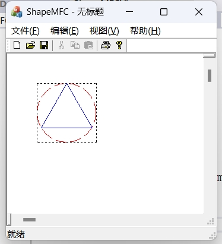

# 第 7 次作业: 第 1 题

## 验证部分

### CP_Point 类的功能

用于定义二维平面上的“点”。由 $x$ 坐标 `m_x` 和 $y$ 坐标 `m_y` 构成。

```cpp
#ifndef CP_POINT_H
#define CP_POINT_H

class CP_Point {
public:
	double m_x, m_y;
public:
	CP_Point(double x = 0.0, double y = 0.0);
	CP_Point(const CP_Point& p);
};
#endif
```

### CP_Circle 类的功能

用于定义二维平面上的“圆”。由圆心（一个点） `m_center` 和半径 `m_radius` 构成。

```cpp
#ifndef CP_CIRCLE_H
#define CP_CIRCLE_H

#include "CP_Point.h"

class CP_Circle {
public:
	CP_Point m_center;
	double m_radius;
public:
	CP_Circle(CP_Point c, double r = 0.0);
	CP_Circle(const CP_Circle& p);
};
#endif
```

### CP_Square 类的功能

用于定义二维平面上的“正方形”。由中心（一个点）`m_center` 和边长 `m_side_length` 构成。

```cpp
#ifndef CP_SQUARE_H
#define CP_SQUARE_H

#include "CP_Point.h"

class CP_Square {
public:
	CP_Point m_center;
	double m_side_length;
public:
	CP_Square(CP_Point c, double l = 0.0);
	CP_Square(const CP_Square& p);
};
#endif
```

### CP_Triangle 类的功能

用于定义二维平面上的“正三角形”。由中心（一个点）`m_center` 和边长 `m_side_length` 构成。

```cpp
#ifndef CP_TRIANGLE_H
#define CP_TRIANGLE_H

#include "CP_Point.h"

class CP_Triangle {
public:
	CP_Point m_center;
	double m_side_length;
public:
	CP_Triangle(CP_Point c, double l = 0.0);
	CP_Triangle(const CP_Triangle& p);
	virtual ~CP_Triangle() {};
};
#endif
```

### 最终结果的图案

在 $(100, 100)$ 分别画出半径为 $50$ 的圆形，边长为 $100$ 的正方形和边长为 $50\sqrt{3}$ 的正三角形如下：


