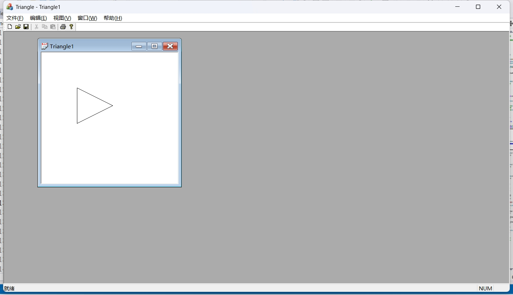
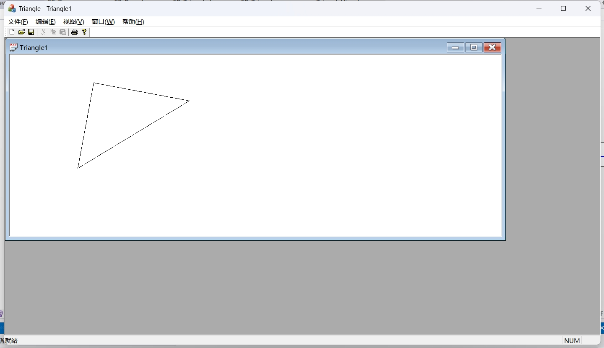
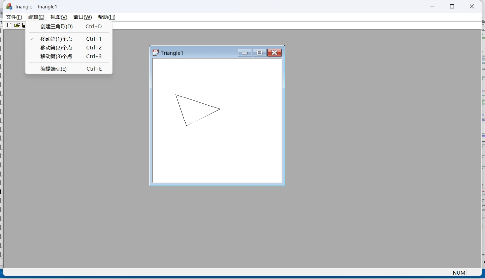
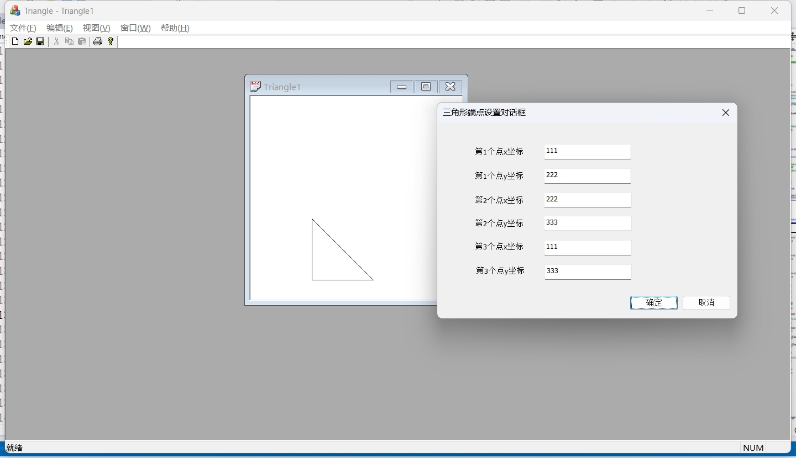
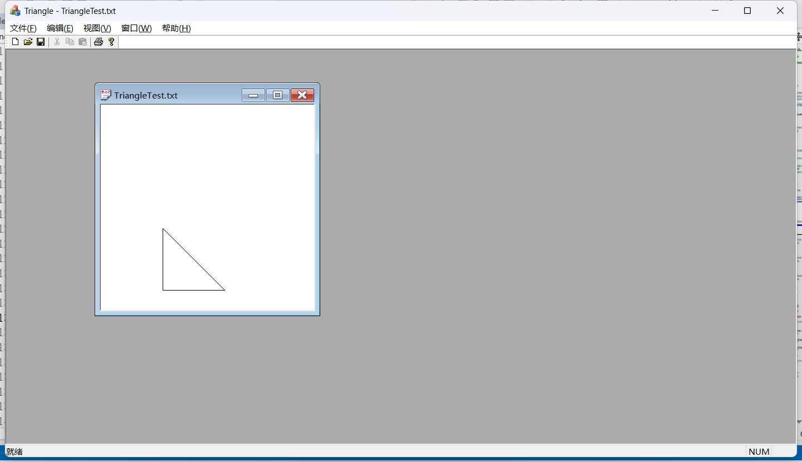
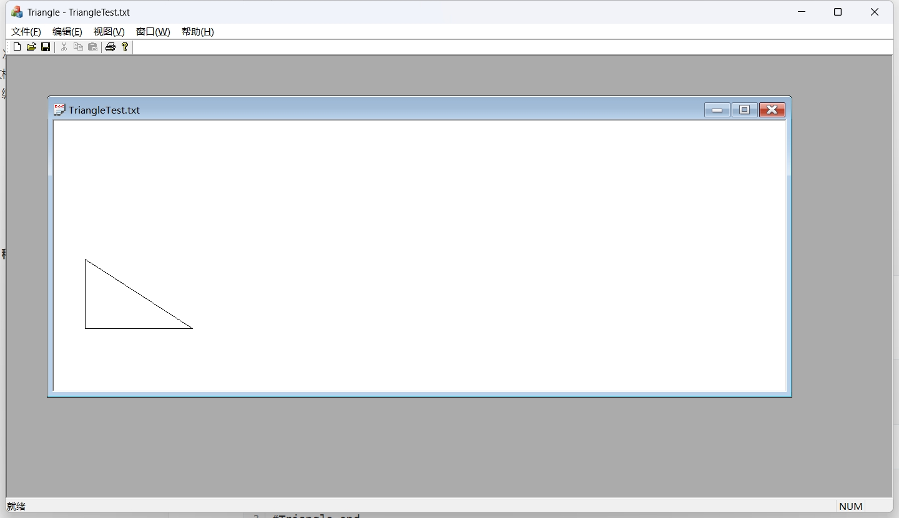

# 第 8 次作业: 第 1 题

## 文档部分

### 编程思路

#### 点

定义二维平面上的“点”。由 $x$ 坐标 `m_x` 和 $y$ 坐标 `m_y` 构成。

```cpp
#ifndef CP_POINT_H
#define CP_POINT_H

class CP_Point {
public:
	double m_x, m_y;
public:
	CP_Point(double x = 0.0, double y = 0.0);
	CP_Point(const CP_Point& p);
};
#endif
```

#### 三角形

定义二维平面上的“三角形”。由三个点 `m_a`、`m_b` 和 `m_c` 构成。

```cpp
#ifndef CP_TRIANGLE_H
#define CP_TRIANGLE_H

#include "CP_Point.h"

class CP_Triangle {
public:
	CP_Point m_a, m_b, m_c; // 三角形的三个顶点
public:
	CP_Triangle(CP_Point a, CP_Point b, CP_Point c);
	CP_Triangle(const CP_Triangle& p);
	virtual ~CP_Triangle() {};
};
#endif
```

#### 画图函数

定义画图函数 `gb_draw()`，它的功能是画出连接三角形三个顶点间的线段。

```cpp
#include "pch.h"
#include "CP_Draw.h"

void gb_draw(CDC& d, const CP_Triangle& t, int style, int r, int g, int b) {
    CPen pen(style, 1, RGB(r, g, b));
    CPen* oldPen = d.SelectObject(&pen);

    // 画出第一条边
    d.MoveTo((int)(t.m_a.m_x + 0.5), (int)(t.m_a.m_y + 0.5));
    d.LineTo((int)(t.m_b.m_x + 0.5), (int)(t.m_b.m_y + 0.5));

    // 画出第二条边
    d.MoveTo((int)(t.m_b.m_x + 0.5), (int)(t.m_b.m_y + 0.5));
    d.LineTo((int)(t.m_c.m_x + 0.5), (int)(t.m_c.m_y + 0.5));

    // 画出第三条边
    d.MoveTo((int)(t.m_c.m_x + 0.5), (int)(t.m_c.m_y + 0.5));
    d.LineTo((int)(t.m_a.m_x + 0.5), (int)(t.m_a.m_y + 0.5));

    d.SelectObject(oldPen); // 恢复原有画笔
}
```

#### 序列化

按照以下格式序列化导出自描述文件：

```
#Triangle begin
<x_1>,<y_1>,<x_2>,<y_2>,<x_3>,<y_3>
#Triangle end
```

序列化代码如下：

```cpp
void CTriangleDoc::Serialize(CArchive& ar)
{
	int flag;
	CString cs;
	wchar_t* buf;
	if (ar.IsStoring())
	{
		// TODO: 在此添加存储代码
		cs.Format(_T("#Triangle begin\n"));
		ar.WriteString(cs);
		cs.Format(_T("%g,%g,%g,%g,%g,%g\n"),
			m_triangle.m_a.m_x, m_triangle.m_a.m_y,
			m_triangle.m_b.m_x, m_triangle.m_b.m_y,
			m_triangle.m_c.m_x, m_triangle.m_c.m_y);
		ar.WriteString(cs);
		cs.Format(_T("#Triangle end\n"));
		ar.WriteString(cs);
	}
	else
	{
		// TODO: 在此添加加载代码
		flag = 0;
		while (ar.ReadString(cs)) {
			cs.Trim();
			if (flag == 0) {
				// 去除不可见字符
				if (cs[0] < ' ' || cs[0] > '~') 
					cs = cs.Mid(1);
				if (cs.CompareNoCase(_T("#Triangle begin")) == 0)
					flag = 1;
			}
			else if (flag == 1) {
				buf = cs.GetBuffer();
				swscanf_s(buf, _T("%lf,%lf,%lf,%lf,%lf,%lf"),
					&(m_triangle.m_a.m_x), &(m_triangle.m_a.m_y),
					&(m_triangle.m_b.m_x), &(m_triangle.m_b.m_y),
					&(m_triangle.m_c.m_x), &(m_triangle.m_c.m_y));
				break;
			}
		}
	}
}
```

#### 创建三角形

```cpp
void CTriangleView::OnEditTriangle()
{
	// TODO: 在此添加命令处理程序代码
	m_flag = 0;
	m_count = 1;
}


void CTriangleView::OnUpdateEditTriangle(CCmdUI* pCmdUI)
{
	// TODO: 在此添加命令更新用户界面处理程序代码
	pCmdUI->SetCheck((m_flag == 0) ? 1 : 0);
}
```

#### 移动顶点

```cpp
void CTriangleView::OnEditOne()
{
	// TODO: 在此添加命令处理程序代码
	m_flag = 1;
}


void CTriangleView::OnUpdateEditOne(CCmdUI* pCmdUI)
{
	// TODO: 在此添加命令更新用户界面处理程序代码
	pCmdUI->SetCheck((m_flag == 1) ? 1 : 0);
}
```

#### 编辑顶点

```cpp
void CTriangleView::OnEditDialog()
{
	// TODO: 在此添加命令处理程序代码
	CTriangleDoc* pDoc = GetDocument();
	ASSERT_VALID(pDoc);
	if (!pDoc)
		return;
	CDialogCoordinates d;
	d.m_a_x = pDoc->m_triangle.m_a.m_x;
	d.m_a_y = pDoc->m_triangle.m_a.m_y;
	d.m_b_x = pDoc->m_triangle.m_b.m_x;
	d.m_b_y = pDoc->m_triangle.m_b.m_y;
	d.m_c_x = pDoc->m_triangle.m_c.m_x;
	d.m_c_y = pDoc->m_triangle.m_c.m_y;
	if (IDOK == d.DoModal())
	{
		pDoc->m_triangle.m_a.m_x = d.m_a_x;
		pDoc->m_triangle.m_a.m_y = d.m_a_y;
		pDoc->m_triangle.m_b.m_x = d.m_b_x;
		pDoc->m_triangle.m_b.m_y = d.m_b_y;
		pDoc->m_triangle.m_c.m_x = d.m_c_x;
		pDoc->m_triangle.m_c.m_y = d.m_c_y;
		Invalidate();
	}
	GetParentFrame()->GetMessageBar()
		->SetWindowText(_T("设置三角形端点坐标!"));
}
```

### 程序运行结果

#### 默认值

运行程序，可得到默认图形如下：



#### 创建三角形

可以通过按顺序点击三个点来绘制以这三个点为顶点的三角形：



#### 移动顶点

假设已有图形如下：


可以移动顶点，例如移动第一个顶点：



#### 编辑顶点

可以通过对话框直接编辑三角形的三个顶点：



#### 保存

保存该参数到文本文档 `TriangleTest.txt` 中。



文本文档 `TriangleTest.txt` 中的内容如下：

```
#Triangle begin
111,222,222,333,111,333
#Triangle end
```

#### 打开

将 `TriangleTest.txt` 中内容修改为如下参数：

```
#Triangle begin
50,222,222,333,50,333
#Triangle end
```

再打开，可得到图形：


